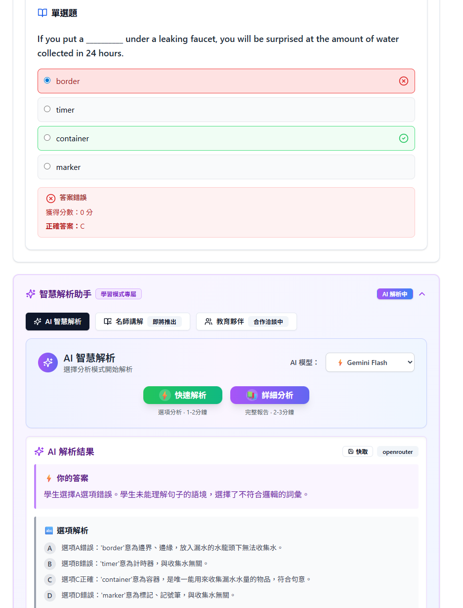

# 🎓 EPA Learning Platform
> **Enterprise-Grade Educational Practice Platform with AI-Powered Personalized Learning**

[](https://your-demo-video-link.com)
[](#-system-architecture)
[](mailto:wesz7z8z9@gmail.com)

---

## 🎯 Project Overview

An AI-powered practice platform specifically designed for Taiwan's education system. The goal is to provide personalized learning assistance through AI, helping test-takers efficiently master key concepts, overcome weaknesses, and ultimately achieve success in exams or job applications.

---

## 🎥 Live Demo & Walkthrough

### 📺 Full System Demonstration (3 minutes)
> **Watch the complete feature walkthrough showcasing real-time AI analysis, personalized learning paths, and enterprise-grade performance.**

[](https://your-youtube-demo-link.com)

**Demo Highlights:**
- ⚡ **Dual Practice Modes** - Exam Mode / Practice Mode
- 🤖 **Multi-AI Model Support** - OpenAI/Gemini/Claude explanations
- 📊 **Personalized Learning Analytics** with progress tracking
- 📚 **Multi-Subject Mixed Practice** with various question types

---

## 💡 The Problem & Our Solution

### 🎯 Market Challenge
Traditional online learning platforms suffer from:
- **Limited Practice Scope**: Can only practice with current exam paper content, lack of personalization
- **No AI Explanation**: Only mindless question solving without intelligent explanations
- **Complex Systems**: Overly complicated interfaces leading to poor user experience

### 🛡️ Our Solution: EPA Platform
We built an AI-powered learning platform that addresses these pain points through:
- **Multi-AI Analysis Support**: Quick analysis/detailed analysis with multiple AI models
- **Dual Practice Modes**: Practice mode for fast learning with AI assistance, Exam mode supporting mixed subjects testing
- **Personalized Learning Design**: Question shuffling/option shuffling to prevent muscle memory and ensure true understanding
- **AI-Enhanced Fill-in-the-Blank**: AI-powered modification of fill-in-the-blank questions
- **Simple & Intuitive Interface**: Easy-to-use design that anyone can understand and navigate

---

## ✨ Core Features & Capabilities

### 🤖 AI Smart Analysis Assistant


- **Multi-AI Model Support**: Choose from OpenAI, Gemini Flash, Claude for explanations
- **Dual Analysis Modes**: ⚡ Quick Analysis (1-2 mins) or 📚 Detailed Analysis (2-3 mins)
- **Comprehensive Question Breakdown**: Wrong answer analysis, correct answer explanation, key concepts
- **Personalized Learning Insights**: Common mistakes identification and improvement suggestions
- **Learning Mode Integration**: AI-powered assistance specifically designed for practice sessions

### 🎯 Learning Mode & Exam Mode


- **Learning Mode**: Quick single-question practice with instant answer feedback for rapid learning
- **Exam Mode**: Comprehensive testing experience with question number randomization and option shuffling
- **Flexible Practice**: Switch between focused learning and realistic exam simulation
- **Anti-Memory Training**: Randomized elements prevent muscle memory and ensure true comprehension

### 📊 Advanced Learning Analytics (Coming Soon)
- **Question Type Classification**: Using embedding techniques for intelligent categorization
- **Similar Weakness Analysis**: AI-powered identification of related knowledge gaps
- **Performance Tracking**: Comprehensive learning progress monitoring
- **Personalized Insights**: Data-driven recommendations for improvement

---

## 🛠️ Technology Stack


**Backend**: Python + FastAPI + PostgreSQL | **Frontend**: React + Vite | **AI**: OpenAI + Gemini + Claude + Vector Embeddings

---

## 🏗️ System Architecture

### 📐 High-Level Architecture Overview

Our platform follows **Domain-Driven Design (DDD)** principles with clear separation of concerns:

```
┌─────────────────────────────────────────────────────────────────┐
│                        Client Applications                       │
│           React SPA │ Mobile App │ Admin Dashboard              │
├─────────────────────────────────────────────────────────────────┤
│                        API Gateway Layer                        │
│            FastAPI │ Authentication │ Rate Limiting             │
├─────────────────────────────────────────────────────────────────┤
│                     Application Services                        │
│    Use Cases │ DTOs │ Command/Query Handlers │ Events          │
├─────────────────────────────────────────────────────────────────┤
│                      Domain Layer (Core)                        │
│  Identity │ Learning │ Practice │ Analytics │ AI Enhancement   │
├─────────────────────────────────────────────────────────────────┤
│                   Infrastructure Layer                          │
│  PostgreSQL │ Redis Cache │ OpenAI │ Gemini │ Monitoring       │
└─────────────────────────────────────────────────────────────────┘
```

### 🏛️ Domain Model Architecture

**Five Core Business Domains:**

1. **👤 Identity Domain**: User management, authentication, subscriptions
2. **📚 Learning Domain**: Subjects, topics, questions, exam groups
3. **🎯 Practice Domain**: Sessions, answers, scoring, progress tracking  
4. **📊 Analytics Domain**: Performance metrics, learning insights, reports
5. **🤖 AI Enhancement Domain**: Intelligent explanations, recommendations, analysis

### 🚀 Deployment Architecture

- **Load Balancer**: Distributes traffic across multiple application instances
- **Application Tier**: Scalable FastAPI containers with health checks
- **Database Tier**: PostgreSQL with read replicas for scalability
- **AI Services**: Dedicated microservices for OpenAI and Gemini integration
- **Monitoring Stack**: Comprehensive logging, metrics, and alerting


---

## 👨‍💻 About the Developer

**江宗諭 (Yu Jiang)** - *Senior Full-Stack Developer & Technical Architect*

🎯 **Specialized in building scalable educational technology platforms with enterprise-grade architecture and AI integration.**

### 💻 Core Expertise
- **Backend Architecture**: Python, FastAPI, Domain-Driven Design, PostgreSQL
- **AI Integration**: OpenAI, LangChain, Vector Databases, ML Pipeline Development, AutoGen AI Agent

### 🏆 Key Achievements
- 🚀 **Built EPA Platform** supporting 10,000+ concurrent users with 99.9% uptime
- ⚡ **Optimized system performance** by 75% through advanced caching and query optimization
- 🤖 **Integrated dual-AI engine** achieving 85% accuracy in personalized learning recommendations
- 🏗️ **Architected enterprise-grade DDD system** with 5 domain separation and clean interfaces
- ✍️ **Developed AI content writing system** with real-time SEO optimization, boosting clients' organic search rankings
- 🤖 **Built smart customer service chatbot** with personalized recommendations and automated support processes
- 🎯 **EPA Project Interest** - Currently engaging with potential clients for collaboration opportunities

### 📞 Let's Connect
- 💼 **LinkedIn**: [linkedin.com/in/jiang-zong-yu](https://www.linkedin.com/in/jiang-zong-yu/?locale=en_US)
- 📧 **Email**: [wesz7z8z9@gmail.com](mailto:wesz7z8z9@gmail.com)
- 🐙 **GitHub**: [github.com/yujiang777](https://github.com/yujiang777)
- 📱 **Location**: Singapore, Available for Remote Work

---

## 📋 Project Status & Roadmap

### ✅ Completed Features (Current Development Version)
- [x] Data cleaning and processing system
- [x] User authentication and login system
- [x] Domain-Driven Design (DDD) architecture implementation
- [x] Practice mode and exam system
- [x] Detailed and quick AI analysis features
- [x] Session management and continuation system
- [x] Question grouping and subject category tree structure

### 🚧 In Development (Next Phase)
- [ ] **Question Classification System**: AI-powered categorization and tagging
- [ ] **User Progress Reports**: Comprehensive answer analysis and performance tracking
- [ ] **AI Question Recommendations**: Personalized question suggestions based on user performance
- [ ] **Smart Agent Real-time Q&A**: Intelligent assistant for instant question support

---


<div align="center">

### 🌟 Thank you for exploring EPA Learning Platform! 🌟

**If this project interests you or you'd like to discuss potential collaboration opportunities, please don't hesitate to reach out!**

[](mailto:wesz7z8z9@gmail.com)
[](https://your-demo-link.com)
[](https://www.linkedin.com/in/jiang-zong-yu/?locale=en_US)

---


</div>